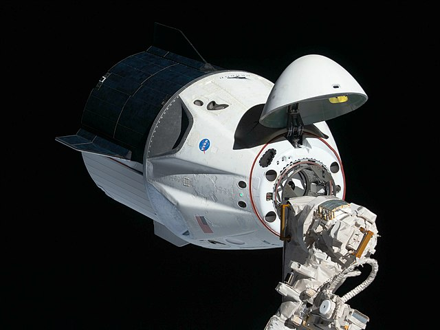

Source: `NASA <https://nasa.gov>`_ `Images <https://images.nasa.gov/details-iss058e027464.html>`_ [Ref1]_

Capsule Information
*******************

This group of API calls will enable the retrieval of capsule data. ALL capsule calls can be given a set of parameters, with which to modify the response.
Like all functions in this module, the API parameters must be given as a JSON payload such as can be seen :doc:`here <jsonpayload>`.

All Capsules
````````````

.. code-block:: python

    capsules = spacexpython.capsules.capsules(parameters,timeOut)
    print(capsule)

Parameters:

.. tabularcolumns:: |1|1|C|C|

+------------+-------------------------------------------+-----------+---------+
| Name       | Purpose                                   | Mandatory | Default |
+============+===========================================+===========+=========+
| parameters | JSON list of URL qualifiers in the form   |      N    |         |
+            +                                           +           +         +
|            | {"status":"active","limit":3 ......etc    |           |         |
+------------+-------------------------------------------+-----------+---------+
| timeOut    | Number of seconds to wait until a timeout |      N    |    1    |
+------------+-------------------------------------------+-----------+---------+

`Valid parameters <https://docs.spacexdata.com/?version=latest#00ac651a-8ba2-4b4c-858a-4034dd1254fa>`_

Specific Capsule
````````````````

.. code-block:: python

    capsule = spacexpython.capsules.one(capsule_id,parameters,timeOut)
    print(capsule)

Parameters:

.. tabularcolumns:: |1|1|C|C|

+------------+-------------------------------------------+-----------+---------+
| Name       | Purpose                                   | Mandatory | Default |
+============+===========================================+===========+=========+
| capsule_id | ID of the capsule                         |      Y    |         |
+------------+-------------------------------------------+-----------+---------+
| parameters | JSON list of URL qualifiers in the form   |      N    |         |
+            +                                           +           +         +
|            | {"status":"active","limit":3 ......etc    |           |         |
+------------+-------------------------------------------+-----------+---------+
| timeOut    | Number of seconds to wait until a timeout |      N    |    1    |
+------------+-------------------------------------------+-----------+---------+

`Valid parameters <https://docs.spacexdata.com/?version=latest#4376c913-2589-4afd-a5f2-80ab8adc3fd0>`_

Upcoming Capsules
`````````````````

.. code-block:: python

    upcoming_capsules = spacexpython.capsules.upcoming(parameters,timeOut)
    print(upcoming_capsules)

Parameters:

.. tabularcolumns:: |1|1|C|C|

+------------+-------------------------------------------+-----------+---------+
| Name       | Purpose                                   | Mandatory | Default |
+============+===========================================+===========+=========+
| parameters | JSON list of URL qualifiers in the form   |      N    |         |
+            +                                           +           +         +
|            | {"status":"active","limit":3 ......etc    |           |         |
+------------+-------------------------------------------+-----------+---------+
| timeOut    | Number of seconds to wait until a timeout |      N    |    1    |
+------------+-------------------------------------------+-----------+---------+

`Valid parameters <https://docs.spacexdata.com/?version=latest#08eb1220-8c52-4062-8147-d9ad33c2a891>`_

Past Capsules
`````````````

.. code-block:: python

    past_capsules = spacexpython.capsules.past(parameters,timeOut)
    print(past_capsules)

Parameters:

.. tabularcolumns:: |1|1|C|C|

+------------+-------------------------------------------+-----------+---------+
| Name       | Purpose                                   | Mandatory | Default |
+============+===========================================+===========+=========+
| parameters | JSON list of URL qualifiers in the form   |      N    |         |
+            +                                           +           +         +
|            | {"status":"active","limit":3 ......etc    |           |         |
+------------+-------------------------------------------+-----------+---------+
| timeOut    | Number of seconds to wait until a timeout |      N    |    1    |
+------------+-------------------------------------------+-----------+---------+

`Valid parameters <https://docs.spacexdata.com/?version=latest#cc22ddc7-1e9c-47c8-8758-bfa58ca13191>`_

.. [Ref1] iss058e027464 (March 4, 2019) --- The uncrewed SpaceX Crew Dragon spacecraft is the first Commercial Crew vehicle to visit the International Space Station. Here it is pictured with its nose cone open revealing its docking mechanism while approaching the station's Harmony module. The Crew Dragon would automatically dock moments later to the international docking adapter attached to the forward end of Harmony.