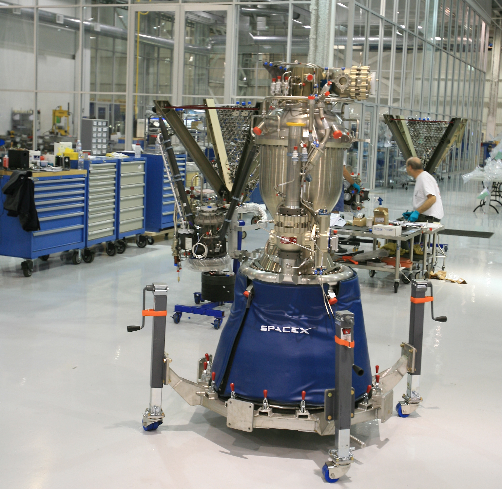

Source: [Ref2]_

Core Information
*******************

This group of API calls will enable the retrieval of core data. ALL core calls can be given a set of parameters, with which to modify the response.
Like all functions in this module, the API parameters must be given as a JSON payload such as can be seen :doc:`here <jsonpayload>`.

All Cores
````````````

.. code-block:: python

    cores = spacexpython.cores(parameters,timeOut)
    print(core)

Parameters:

.. tabularcolumns:: |1|1|C|C|

+------------+-------------------------------------------+-----------+---------+
| Name       | Purpose                                   | Mandatory | Default |
+============+===========================================+===========+=========+
| parameters | JSON list of URL qualifiers in the form   |      N    |         |
+            +                                           +           +         +
|            | {"status":"active","limit":3 ......etc    |           |         |
+------------+-------------------------------------------+-----------+---------+
| timeOut    | Number of seconds to wait until a timeout |      N    |    1    |
+------------+-------------------------------------------+-----------+---------+

`Valid parameters <https://docs.spacexdata.com/?version=latest#8841c0cf-4341-4c73-852e-df4d90a7db98>`_

Specific Core
````````````````

.. code-block:: python

    core = spacexpython.one(core_id,parameters,timeOut)
    print(core)

Parameters:

.. tabularcolumns:: |1|1|C|C|

+------------+-------------------------------------------+-----------+---------+
| Name       | Purpose                                   | Mandatory | Default |
+============+===========================================+===========+=========+
| core_id    | ID of the core                            |      Y    |         |
+------------+-------------------------------------------+-----------+---------+
| parameters | JSON list of URL qualifiers in the form   |      N    |         |
+            +                                           +           +         +
|            | {"status":"active","limit":3 ......etc    |           |         |
+------------+-------------------------------------------+-----------+---------+
| timeOut    | Number of seconds to wait until a timeout |      N    |    1    |
+------------+-------------------------------------------+-----------+---------+

`Valid parameters <https://docs.spacexdata.com/?version=latest#dc18b875-5f98-4e44-a124-ad95647335dc>`_

Upcoming Cores
`````````````````

.. code-block:: python

    upcoming_cores = spacexpython.cores.upcoming()
    print(upcoming_cores)

Parameters:

.. tabularcolumns:: |1|1|C|C|

+------------+-------------------------------------------+-----------+---------+
| Name       | Purpose                                   | Mandatory | Default |
+============+===========================================+===========+=========+
| parameters | JSON list of URL qualifiers in the form   |      N    |         |
+            +                                           +           +         +
|            | {"status":"active","limit":3 ......etc    |           |         |
+------------+-------------------------------------------+-----------+---------+
| timeOut    | Number of seconds to wait until a timeout |      N    |    1    |
+------------+-------------------------------------------+-----------+---------+

`Valid parameters <https://docs.spacexdata.com/?version=latest#a22624ca-36bd-4d20-932c-f5c1897ae75b>`_

Past Cores
`````````````

.. code-block:: python

    past_cores = spacexpython.cores.past()
    print(past_cores)

Parameters:

.. tabularcolumns:: |1|1|C|C|

+------------+-------------------------------------------+-----------+---------+
| Name       | Purpose                                   | Mandatory | Default |
+============+===========================================+===========+=========+
| parameters | JSON list of URL qualifiers in the form   |      N    |         |
+            +                                           +           +         +
|            | {"status":"active","limit":3 ......etc    |           |         |
+------------+-------------------------------------------+-----------+---------+
| timeOut    | Number of seconds to wait until a timeout |      N    |    1    |
+------------+-------------------------------------------+-----------+---------+

`Valid parameters <https://docs.spacexdata.com/?version=latest#3e925329-8706-4859-8a7b-d6bcfd1d866a>`_

.. [Ref2] By Steve Jurvetson from Menlo Park, USA - Flickr: Merlin Engine, CC BY 2.0 - One of nine Merlin engines used in the Falcon 9 booster.