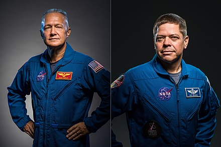

Source: [Ref15]_

Crew Information
****************


.. attention::

    This is ``experimental`` in version 1.1.1a1

    This is not complete in the API, therefore the wrapper will return no data until there is a complete implementation.

Crew Information
```````````````````

.. code-block:: python

    crew = spacexpython.crew.crew(timeOut)
    print(crew)

Parameter:

.. tabularcolumns:: |1|1|C|C|

+------------+-------------------------------------------+-----------+---------+
| Name       | Purpose                                   | Mandatory | Default |
+============+===========================================+===========+=========+
| timeOut    | Number of seconds to wait until a timeout |      N    |    1    |
+------------+-------------------------------------------+-----------+---------+


.. [Ref15] The first two crew for SpaceX (Mission SpaceX Demo-2) planned for 30th November 2019.
           Crew members are Douglas G Hurley and Robert L Behnken (both of NASA)