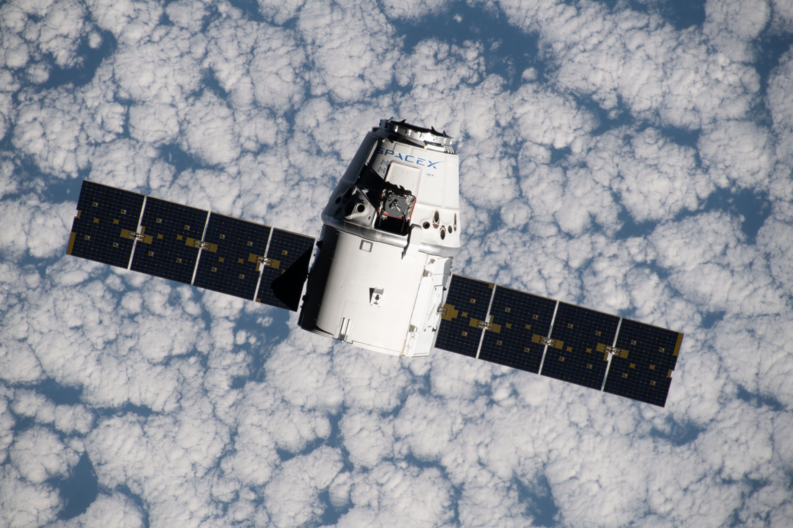

Source: `NASA <http://nasa.gov>`_ [Ref3]_

Dragon Information
*******************

This group of API calls will enable the retrieval of Dragon data. ALL Dragon calls can be given a set of parameters, with which to modify the response.
Like all functions in this module, the API parameters must be given as a JSON payload such as can be seen :doc:`here <./useful/jsonpayload>`.

All Dragons
```````````

.. code-block:: python

    dragons = spacexpython.dragons.dragons(parameters,timeOut)
    print(dragon)

Parameters:

.. tabularcolumns:: |1|1|C|C|

+------------+-------------------------------------------+-----------+---------+
| Name       | Purpose                                   | Mandatory | Default |
+============+===========================================+===========+=========+
| parameters | JSON list of URL qualifiers in the form   |      N    |         |
+            +                                           +           +         +
|            | {"status":"active","limit":3 ......etc    |           |         |
+------------+-------------------------------------------+-----------+---------+
| timeOut    | Number of seconds to wait until a timeout |      N    |    1    |
+------------+-------------------------------------------+-----------+---------+

`Valid parameters <https://docs.spacexdata.com/?version=latest#32f4fc1e-37e8-4d1b-8ec4-ac729441ddb2>`_

Specific Dragon
```````````````

.. code-block:: python

    dragon = spacexpython.dragons.one(dragon_id,parameters,timeOut)
    print(dragon)

Parameters:

.. tabularcolumns:: |1|1|C|C|

+------------+-------------------------------------------+-----------+---------+
| Name       | Purpose                                   | Mandatory | Default |
+============+===========================================+===========+=========+
| dragon_id  | ID of the dragon capsule                  |      Y    |         |
+------------+-------------------------------------------+-----------+---------+
| parameters | JSON list of URL qualifiers in the form   |      N    |         |
+            +                                           +           +         +
|            | {"status":"active","limit":3 ......etc    |           |         |
+------------+-------------------------------------------+-----------+---------+
| timeOut    | Number of seconds to wait until a timeout |      N    |    1    |
+------------+-------------------------------------------+-----------+---------+

`Valid parameters <https://docs.spacexdata.com/?version=latest#a9129d6a-1bab-42a1-af1b-2b1064016f9d>`_

.. [Ref3] `Source <https://www.flickr.com/photos/nasa2explore/48432875977/>`_ The SpaceX Dragon space freighter approaches the International Space Station as both spacecraft were orbiting 265 miles above the Atlantic Ocean off the west coast of Namibia.