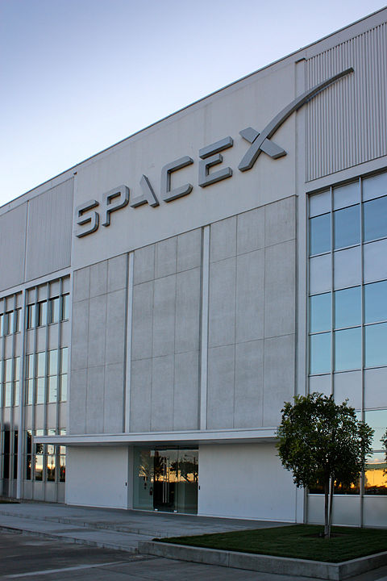

Source: [Ref5]_ Source `Bruno Sanchez-Andrade Nuño <https://www.flickr.com/photos/64887888@N00>`_ from Washington, DC, USA`

Company and API Information
***************************

This group of API calls allows the retrieval of information regarding :

* SpaceX corporate information
* API Information

Like all functions in this module, the API parameters must be given as a JSON payload such as can be seen :doc:`here <jsonpayload>`.

Company Information
```````````````````

.. code-block:: python

    info = spacexpython.info.company(timeOut)
    print(info)

Parameter:

.. tabularcolumns:: |1|1|C|C|

+------------+-------------------------------------------+-----------+---------+
| Name       | Purpose                                   | Mandatory | Default |
+============+===========================================+===========+=========+
| timeOut    | Number of seconds to wait until a timeout |      N    |    1    |
+------------+-------------------------------------------+-----------+---------+

`More Details <hhttps://docs.spacexdata.com/?version=latest#9b8b053e-cb75-400c-9635-5fe1c771d8a3>`_

API Details
```````````````````````

.. code-block:: python

    api = spacexpython.info.api(timeOut)
    print(api)

Parameter:

.. tabularcolumns:: |1|1|C|C|

+------------+-------------------------------------------+-----------+---------+
| Name       | Purpose                                   | Mandatory | Default |
+============+===========================================+===========+=========+
| timeOut    | Number of seconds to wait until a timeout |      N    |    1    |
+------------+-------------------------------------------+-----------+---------+

`More Details <https://docs.spacexdata.com/?version=latest#30c2d33b-4943-43ae-a98a-5ede3ece6388>`_

.. [Ref5] The company's headquarters, located in Hawthorne, California.