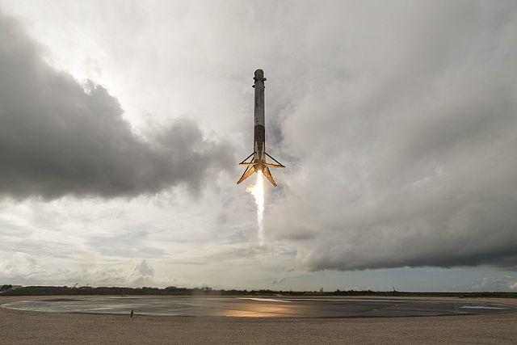

Source: `SpaceX <https://www.flickr.com/photos/spacex/34272065153/in/photostream/>`_ [Ref6]_

Landing Pad Information
***********************

This group of API calls will enable the retrieval of data about the various landing pads that SpaceX uses.
ALL these calls can be given a set of parameters, with which to modify the response.
Like all functions in this module, the API parameters must be given as a JSON payload such as can be seen :doc:`here <jsonpayload>`.

All Landing Pads
````````````````

.. code-block:: python

    landingpads = spacexpython.landingpads.landingpads(parameters,timeOut)
    print(landingpads)

Parameters:

.. tabularcolumns:: |1|1|C|C|

+------------+-------------------------------------------+-----------+---------+
| Name       | Purpose                                   | Mandatory | Default |
+============+===========================================+===========+=========+
| parameters | JSON list of URL qualifiers in the form   |      N    |         |
+            +                                           +           +         +
|            | {"status":"active","limit":3 ......etc    |           |         |
+------------+-------------------------------------------+-----------+---------+
| timeOut    | Number of seconds to wait until a timeout |      N    |    1    |
+------------+-------------------------------------------+-----------+---------+

`Valid parameters <hhttps://docs.spacexdata.com/?version=latest#c58f85b5-ee5f-4343-80fd-ec893faa9133>`_

Specific Landing Pad
````````````````````

.. code-block:: python

    landingpad = spacexpython.landingpads.one(landingpad_id,parameters,timeOut)
    print(landingpad)

Parameters:

.. tabularcolumns:: |1|1|C|C|

+---------------+-------------------------------------------+-----------+---------+
| Name          | Purpose                                   | Mandatory | Default |
+===============+===========================================+===========+=========+
| landingpad_id | ID of the landingpad                      |      Y    |         |
+---------------+-------------------------------------------+-----------+---------+
| parameters    | JSON list of URL qualifiers in the form   |      N    |         |
+               +                                           +           +         +
|               | {"status":"active","limit":3 ......etc    |           |         |
+---------------+-------------------------------------------+-----------+---------+
| timeOut       | Number of seconds to wait until a timeout |      N    |    1    |
+---------------+-------------------------------------------+-----------+---------+

`Valid parameters <https://docs.spacexdata.com/?version=latest#5fbbc3cc-6409-4607-a679-19be39bc9cea>`_

.. [Ref6]  Falcon 9 First Stage Landing at LZ-1 on the CRS-11 mission