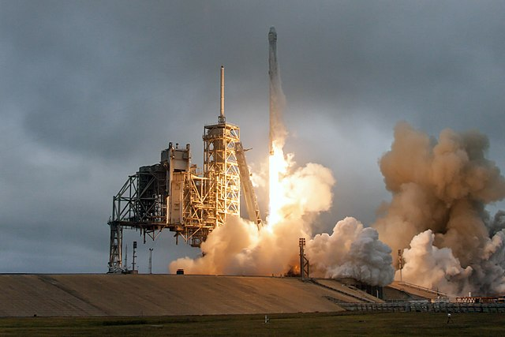

Source: `SpaceX <http://spacex.com>`_ [Ref7]_

Launch Information
*******************

This group of API calls will enable the retrieval of Launch data. 
ALL Launch calls can be given a set of parameters, with which to modify the response.
Like all functions in this module, the API parameters must be given as a JSON payload such as can be seen :doc:`here <jsonpayload>`.

All Launches
```````````

.. code-block:: python

    launches = spacexpython.launches.launches(parameters,timeOut)
    print(launches)

Parameters:

.. tabularcolumns:: |1|1|C|C|

+------------+-------------------------------------------+-----------+---------+
| Name       | Purpose                                   | Mandatory | Default |
+============+===========================================+===========+=========+
| parameters | JSON list of URL qualifiers in the form   |      N    |         |
+            +                                           +           +         +
|            | {"status":"active","limit":3 ......etc    |           |         |
+------------+-------------------------------------------+-----------+---------+
| timeOut    | Number of seconds to wait until a timeout |      N    |    1    |
+------------+-------------------------------------------+-----------+---------+

`Valid parameters <https://docs.spacexdata.com/?version=latest#5fc4c846-c373-43df-a10a-e9faf80a8b0a>`_

Specific Launch
```````````````
.. important::

    As of version v1.1.0.alpha4, this feature is not implemented. It will be implemented in a future release.

.. code-block:: python

    launch = spacexpython.launches.one(launch_id,parameters,timeOut)
    print(Launch)

Parameters:

.. tabularcolumns:: |1|1|C|C|

+------------+-------------------------------------------+-----------+---------+
| Name       | Purpose                                   | Mandatory | Default |
+============+===========================================+===========+=========+
| launch_id  | ID of the Launch                          |      Y    |         |
+------------+-------------------------------------------+-----------+---------+
| parameters | JSON list of URL qualifiers in the form   |      N    |         |
+            +                                           +           +         +
|            | {"status":"active","limit":3 ......etc    |           |         |
+------------+-------------------------------------------+-----------+---------+
| timeOut    | Number of seconds to wait until a timeout |      N    |    1    |
+------------+-------------------------------------------+-----------+---------+

`Valid parameters <https://docs.spacexdata.com/?version=latest#5fc4c846-c373-43df-a10a-e9faf80a8b0a>`_

Upcoming Launches
`````````````````

.. code-block:: python

    upcoming_launches = spacexpython.launches.upcoming(parameters,timeOut)
    print(upcoming_launches)

Parameters:

.. tabularcolumns:: |1|1|C|C|

+------------+-------------------------------------------+-----------+---------+
| Name       | Purpose                                   | Mandatory | Default |
+============+===========================================+===========+=========+
| parameters | JSON list of URL qualifiers in the form   |      N    |         |
+            +                                           +           +         +
|            | {"status":"active","limit":3 ......etc    |           |         |
+------------+-------------------------------------------+-----------+---------+
| timeOut    | Number of seconds to wait until a timeout |      N    |    1    |
+------------+-------------------------------------------+-----------+---------+

`Valid parameters <https://docs.spacexdata.com/?version=latest#e001c501-9c09-4703-9e29-f91fbbf8db7c>`_

Next Launch
```````````

.. code-block:: python

    next_launch = spacexpython.launches.nextlaunch(timeOut)
    print(next_launch)

Parameters:

.. tabularcolumns:: |1|1|C|C|

+------------+-------------------------------------------+-----------+---------+
| Name       | Purpose                                   | Mandatory | Default |
+============+===========================================+===========+=========+
| timeOut    | Number of seconds to wait until a timeout |      N    |    1    |
+------------+-------------------------------------------+-----------+---------+

`Valid parameters <https://docs.spacexdata.com/?version=latest#c75a20cf-50e7-4a4a-8856-ee729e0d3868>`_

Latest Launch
```````````

.. code-block:: python

    latest_launch = spacexpython.launches.latest(timeOut)
    print(latest_launch)

Parameters:

.. tabularcolumns:: |1|1|C|C|

+------------+-------------------------------------------+-----------+---------+
| Name       | Purpose                                   | Mandatory | Default |
+============+===========================================+===========+=========+
| timeOut    | Number of seconds to wait until a timeout |      N    |    1    |
+------------+-------------------------------------------+-----------+---------+

`Valid parameters <https://docs.spacexdata.com/?version=latest#07a29989-38e3-47fb-9f64-c132b5842ff0>`_

Past Launches
`````````````

.. important::

    As of version v1.1.0.alpha4, this feature is not implemented. It will be implemented in a future release.

.. code-block:: python

    past_launches = spacexpython.launches.past(parameters,timeOut)
    print(past_launches)

Parameters:

.. tabularcolumns:: |1|1|C|C|

+------------+-------------------------------------------+-----------+---------+
| Name       | Purpose                                   | Mandatory | Default |
+============+===========================================+===========+=========+
| parameters | JSON list of URL qualifiers in the form   |      N    |         |
+            +                                           +           +         +
|            | {"status":"active","limit":3 ......etc    |           |         |
+------------+-------------------------------------------+-----------+---------+
| timeOut    | Number of seconds to wait until a timeout |      N    |    1    |
+------------+-------------------------------------------+-----------+---------+

`Valid parameters <https://docs.spacexdata.com/?version=latest#3e925329-8706-4859-8a7b-d6bcfd1d866a>`_

.. [Ref7] Falcon 9 and Dragon lift off from Launch Pad 39A for CRS-10