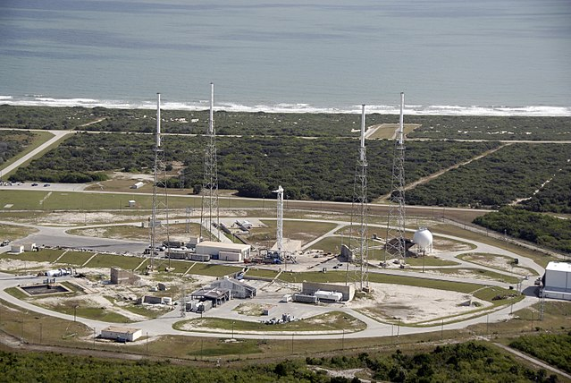

Source: `NASA/Kim Shiflett <http://mediaarchive.ksc.nasa.gov/detail.cfm?mediaid=43863>`_ [Ref13]_

Launch Pad Information
**********************

This group of API calls will enable the retrieval of data about the various launch pads that SpaceX uses.
ALL these calls can be given a set of parameters, with which to modify the response.
Like all functions in this module, the API parameters must be given as a JSON payload such as can be seen :doc:`here <./useful/jsonpayload>`.

All Launch Pads
```````````````

.. code-block:: python

    launchpads = spacexpython.launchpads.launchpads(parameters,timeOut)
    print(launchpads)

Parameters:

.. tabularcolumns:: |1|1|C|C|

+------------+-------------------------------------------+-----------+---------+
| Name       | Purpose                                   | Mandatory | Default |
+============+===========================================+===========+=========+
| parameters | JSON list of URL qualifiers in the form   |      N    |         |
+            +                                           +           +         +
|            | {"status":"active","limit":3 ......etc    |           |         |
+------------+-------------------------------------------+-----------+---------+
| timeOut    | Number of seconds to wait until a timeout |      N    |    1    |
+------------+-------------------------------------------+-----------+---------+

`Valid parameters <https://docs.spacexdata.com/?version=latest#58df29dc-5839-42fc-9540-2f572fd13438>`_

Specific Launch Pad
```````````````````

.. code-block:: python

    launchpad = spacexpython.launchpads.one(launchpad_id,parameters,timeOut)
    print(launchpad)

Parameters:

.. tabularcolumns:: |1|1|C|C|

+---------------+-------------------------------------------+-----------+---------+
| Name          | Purpose                                   | Mandatory | Default |
+===============+===========================================+===========+=========+
| launchpad_id  | ID of the launchpad                       |      Y    |         |
+---------------+-------------------------------------------+-----------+---------+
| parameters    | JSON list of URL qualifiers in the form   |      N    |         |
+               +                                           +           +         +
|               | {"status":"active","limit":3 ......etc    |           |         |
+---------------+-------------------------------------------+-----------+---------+
| timeOut       | Number of seconds to wait until a timeout |      N    |    1    |
+---------------+-------------------------------------------+-----------+---------+

`Valid parameters <https://docs.spacexdata.com/?version=latest#fbc2676e-6248-48ce-95c8-c64784638288>`_

.. [Ref13]  Taken: October 23rd 2009 - An aerial view of Space Launch Complex 40 on Cape Canaveral Air Force Station. The pad will be used to support the new Falcon rockets to be launched by Space Exploration Technologies, known as SpaceX.
           `Camera Location <https://tools.wmflabs.org/geohack/geohack.php?pagename=File:Launch_pad_40_awaiting_Falcon_9_rocket.jpg&params=028.562080_N_-080.583541_E_globe:Earth_type:camera_&language=en>`_