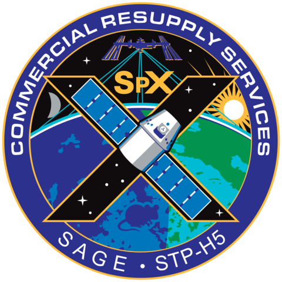

Source: `Collectspace <http://www.collectspace.com/ubb/Forum18/HTML/001280.html>`_ [Ref8]_

Mission Information
**********************

This group of API calls will enable the retrieval of data about the various missions that SpaceX has been involved in.
ALL these calls can be given a set of parameters, with which to modify the response.
Like all functions in this module, the API parameters must be given as a JSON payload such as can be seen :doc:`here <./useful/jsonpayload>`.

All Missions
````````````

.. code-block:: python

    missions = spacexpython.missions.missions(parameters,timeOut)
    print(missions)

Parameters:

.. tabularcolumns:: |1|1|C|C|

+------------+-------------------------------------------+-----------+---------+
| Name       | Purpose                                   | Mandatory | Default |
+============+===========================================+===========+=========+
| parameters | JSON list of URL qualifiers in the form   |      N    |         |
+            +                                           +           +         +
|            | {"status":"active","limit":3 ......etc    |           |         |
+------------+-------------------------------------------+-----------+---------+
| timeOut    | Number of seconds to wait until a timeout |      N    |    1    |
+------------+-------------------------------------------+-----------+---------+

`Valid parameters <https://docs.spacexdata.com/?version=latest#02badaab-e03e-40c8-ab20-3bc76d95d401>`_

Specific Mission
````````````````

.. code-block:: python

    mission = spacexpython.missions.one(mission_id,parameters,timeOut)
    print(mission)

Parameters:

.. tabularcolumns:: |1|1|C|C|

+---------------+-------------------------------------------+-----------+---------+
| Name          | Purpose                                   | Mandatory | Default |
+===============+===========================================+===========+=========+
| mission_id    | ID of the mission                         |      Y    |         |
+---------------+-------------------------------------------+-----------+---------+
| parameters    | JSON list of URL qualifiers in the form   |      N    |         |
+               +                                           +           +         +
|               | {"status":"active","limit":3 ......etc    |           |         |
+---------------+-------------------------------------------+-----------+---------+
| timeOut       | Number of seconds to wait until a timeout |      N    |    1    |
+---------------+-------------------------------------------+-----------+---------+

`Valid parameters <https://docs.spacexdata.com/?version=latest#ccefcfac-5634-4d8e-885b-f3f21b7c539e>`_

.. [Ref8]  NASA's insignia for the tenth Commercial Resupply Services flight to the International Space Station, with "mousetronauts."
           Also includes the Stratospheric Aerosol and Gas Experiment (SAGE) and a Lightning Imaging Sensor, designated STP-H5.