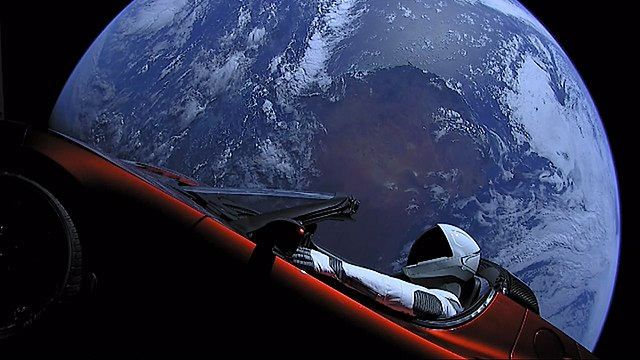

Source: `Falcon Heavy Test Mission <https://www.flickr.com/photos/spacex/40143096241/>`_ [Ref11]_

Roadster Information
********************

This function will return the current orbital parameters of Elon Musk's Tesla Roadster which was launched in February 2018 aboard the first test flight of a Falcon Heavy Rocket.

Roadster Data
`````````````

.. code-block:: python

    roadster = spacexpython.roadster.roadster(timeOut)
    print(roadster)

Parameter:

.. tabularcolumns:: |1|1|C|C|

+------------+-------------------------------------------+-----------+---------+
| Name       | Purpose                                   | Mandatory | Default |
+============+===========================================+===========+=========+
| timeOut    | Number of seconds to wait until a timeout |      N    |    1    |
+------------+-------------------------------------------+-----------+---------+

`More Details <hhttps://docs.spacexdata.com/?version=latest#9b8b053e-cb75-400c-9635-5fe1c771d8a3>`_

.. [Ref11] `Elon Musk's Tesla Roadster <https://en.wikipedia.org/wiki/Elon_Musk%27s_Tesla_Roadster>`_, with Earth in background. "Spaceman" mannequin wearing SpaceX Spacesuit in driving seat. Camera mounted on external boom.