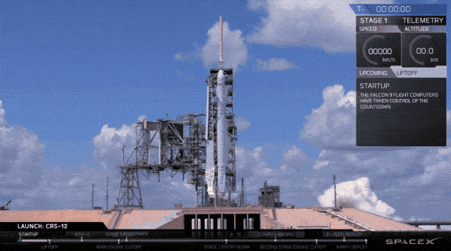

Source: `SpaceX <https://spacex.com>`_ [Ref10]_

Rocket Information
******************

This group of API calls will enable the retrieval of data about the rockets that SpaceX has used over its' launch timeframe.
ALL these calls can be given a set of parameters, with which to modify the response.
Like all functions in this module, the API parameters must be given as a JSON payload such as can be seen :doc:`here <jsonpayload>`.

All Rockets
````````````

.. code-block:: python

    rockets = spacexpython.rockets.rockets(parameters,timeOut)
    print(rockets)

Parameters:

.. tabularcolumns:: |1|1|C|C|

+------------+-------------------------------------------+-----------+---------+
| Name       | Purpose                                   | Mandatory | Default |
+============+===========================================+===========+=========+
| parameters | JSON list of URL qualifiers in the form   |      N    |         |
+            +                                           +           +         +
|            | {"status":"active","limit":3 ......etc    |           |         |
+------------+-------------------------------------------+-----------+---------+
| timeOut    | Number of seconds to wait until a timeout |      N    |    1    |
+------------+-------------------------------------------+-----------+---------+

`Valid parameters <https://docs.spacexdata.com/?version=latest#16c58b5e-44de-4183-b858-0fae51d242a5>`_

Specific Rocket
```````````````

.. code-block:: python

    rocket = spacexpython.rockets.rocket(rocket_id,parameters,timeOut)
    print(rocket)

.. Note::

    The `rocket_id` parameter is one of :

    +-------------+---------------------+
    | Value       | Meaning             |
    +=============+=====================+
    | falcon1     | Falcon 1 Rocket     |
    +-------------+---------------------+
    | falcon9     | Falcon 1 Rocket     |
    +-------------+---------------------+
    | falconheavy | Falcon Heavy Rocket |
    +-------------+---------------------+
    | bfr         | Big Falcon Rocket   |
    +-------------+---------------------+

Parameters:

.. tabularcolumns:: |1|1|C|C|

+---------------+-------------------------------------------+-----------+---------+
| Name          | Purpose                                   | Mandatory | Default |
+===============+===========================================+===========+=========+
| rocket_id     | ID of the rocket                          |      Y    |         |
+---------------+-------------------------------------------+-----------+---------+
| parameters    | JSON list of URL qualifiers in the form   |      N    |         |
+               +                                           +           +         +
|               | {"status":"active","limit":3 ......etc    |           |         |
+---------------+-------------------------------------------+-----------+---------+
| timeOut       | Number of seconds to wait until a timeout |      N    |    1    |
+---------------+-------------------------------------------+-----------+---------+

An additional method of acquiring information about a specific rocket would be to use the rocket-specific functions:

.. code-block:: python

    falcon1     = spacexpython.rockets.falcon1(parameters,timeOut)
    falcon9     = spacexpython.rockets.falcon9(parameters,timeOut)
    falconheavy = spacexpython.rockets.falconheavy(parameters,timeOut)
    bfr         = spacexpython.rockets.bfr(parameters,timeOut)


`Valid parameters <https://docs.spacexdata.com/?version=latest#eda45a06-9f05-40f1-a333-028f647ba797>`_

.. [Ref10]  Launch of Falcon 9 for mission CRS-12 14th August 2017