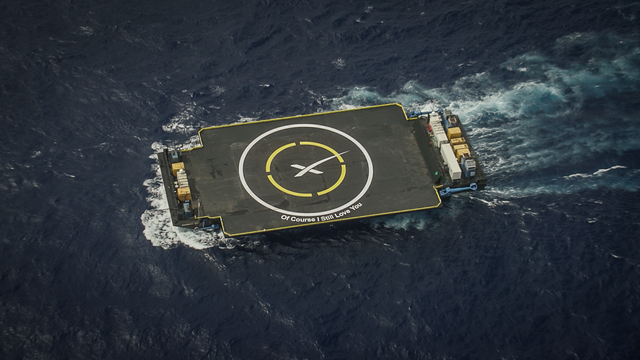

Source: `SpaceX <https://www.flickr.com/photos/spacexphotos/18610429514/>`_ [Ref12]_

Ship Information
******************

This group of API calls will enable the retrieval of data about the ships that SpaceX has used over its' operational timeframe.
These include autonomous drone ships, barges, recovery and transport ships.
ALL these calls can be given a set of parameters, with which to modify the response.
Like all functions in this module, the API parameters must be given as a JSON payload such as can be seen :doc:`here <jsonpayload>`.

All Ships
````````````

.. code-block:: python

    ships = spacexpython.ships.ships(parameters,timeOut)
    print(ships)

Parameters:

.. tabularcolumns:: |1|1|C|C|

+------------+-------------------------------------------+-----------+---------+
| Name       | Purpose                                   | Mandatory | Default |
+============+===========================================+===========+=========+
| parameters | JSON list of URL qualifiers in the form   |      N    |         |
+            +                                           +           +         +
|            | {"status":"active","limit":3 ......etc    |           |         |
+------------+-------------------------------------------+-----------+---------+
| timeOut    | Number of seconds to wait until a timeout |      N    |    1    |
+------------+-------------------------------------------+-----------+---------+

`Valid parameters <https://docs.spacexdata.com/?version=latest#e520e500-0421-4774-8bcb-8d07b7dfa222>`_

Specific Ship
`````````````

.. code-block:: python

    ship = spacexpython.ships.ship(ship_id,parameters,timeOut)
    print(ship)

Parameters:

.. tabularcolumns:: |1|1|C|C|

+---------------+-------------------------------------------+-----------+---------+
| Name          | Purpose                                   | Mandatory | Default |
+===============+===========================================+===========+=========+
| ship_id       | ID of the ship                            |      Y    |         |
+---------------+-------------------------------------------+-----------+---------+
| parameters    | JSON list of URL qualifiers in the form   |      N    |         |
+               +                                           +           +         +
|               | {"status":"active","limit":3 ......etc    |           |         |
+---------------+-------------------------------------------+-----------+---------+
| timeOut       | Number of seconds to wait until a timeout |      N    |    1    |
+---------------+-------------------------------------------+-----------+---------+

`Valid parameters <https://docs.spacexdata.com/?version=latest#d5b89576-eb1d-4a2f-91eb-3eab2b454aa2>`_

.. [Ref12] "Of Course I Still Love You" (Marmac 304) drone ship moving into position for the Sunday, June 28, 2015, SpaceX CRS-7 rocket launch and landing attempt.